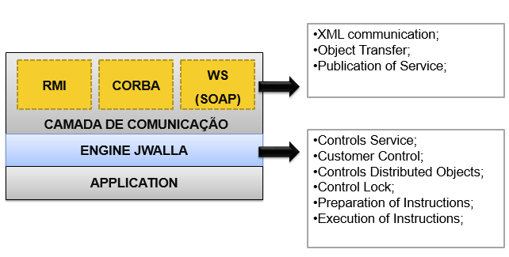
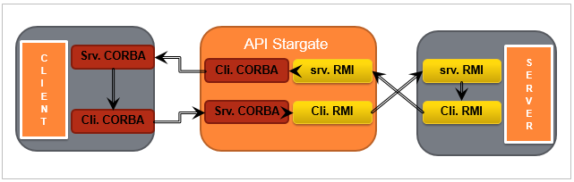
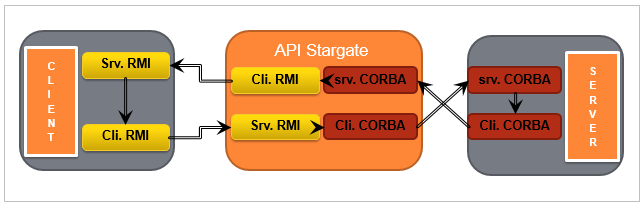

#JWalla

It is a middleware to easily integrate RMI & CORBA. Another feature is the synchronization of method calls between peers(RMI, CORBA and WebService(SOAP)).



* Implementation of the "com.edusasse.jwalla.engine.JwallaDObject" Interface;
* Parametriations: RMI_SERVER; CORBA_SERVER and ALLOW_VIRTUAL_CLIENTS.

````
// Declaring a service
i_Service s1 = new Service(“App.01", “Sample App", "v1.0", "127.0.0.1", 4000);
// Parameters
s1.setParamter(s1.RMI_SERVER, false);
s1.setParamter(s1.CORBA_SERVER, true);
s1.setParamter(s1.ALLOW_VIRTUAL_CLIENTS, true);
````
	
## RMI -> CORBA



## CORBA -> RMI


	
## Stack

* Java
* AspectJ
* CORBA
* RMI
* WebService(SOAP)
* Maven